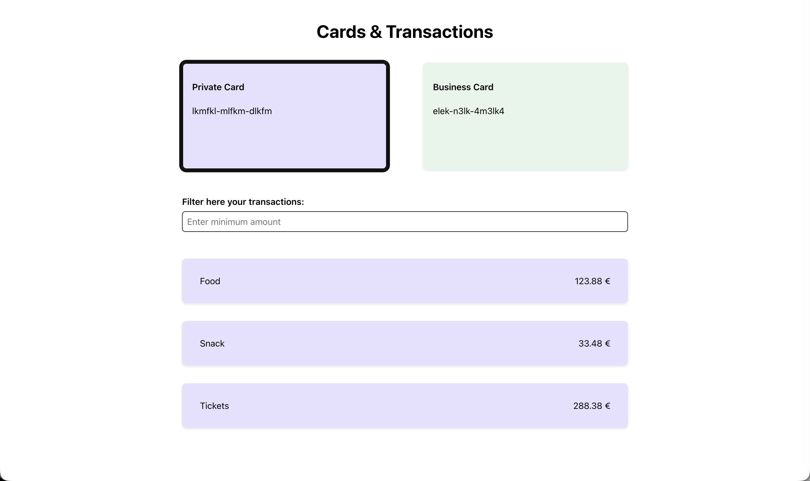

# Cards & Transactions – Frontend Exercise

A React application that displays payment cards, allows users to select a card, and filter its transactions by minimum amount.
(4 hrs task)



## How to Run

```bash
yarn           # Install dependencies
yarn dev       # Start dev server at http://localhost:5173
yarn test      # Run test suite
```

## Assumptions & Trade-offs

- **Local JSON as API simulation**: Data is fetched from local JSON files using the Fetch API to mimic real API calls. This keeps the architecture ready for future backend integration.
- **Simplified State Management**: I used local state and custom hooks (useCards, useTransactions) instead of introducing global state (Redux/RTKQ), as it would be unnecessary for the scope of this task.
- **No external UI libraries**: Styling is done with plain CSS to keep the solution lightweight and focused.
- **Derived state over stored state**: Filtered transactions are computed on render instead of stored, to avoid duplication and keep logic simple.
- **Basic error handling**: Loading and error states are handled, with scope kept minimal for this task
- **Basic accessibility**: Semantic HTML, proper buttons, and minimal ARIA (role="alert", role="status") are used without overcomplicating the implementation.

## What I'd Improve With More Time

- **Performance & Caching**: Cache transactions per card to avoid refetching and memoize filtered results
- **Error Handling**: Add a top-level error boundary for unexpected rendering failures, retry logic for failed requests, and user-friendly error messages
- **Testing**: Add edge case tests (rapid interactions, invalid values, empty states) and test hooks in isolation
- **State Management**: Move to Context API or data-fetching library (React Query/RTK Query) for better data flow management if the app grows
- **Architecture**: Refactor to feature-based folder structure for scalability
- **Styling**: Use Styled Components for cleaner dynamic style handling
- **Accessibility**: Add ARIA labels, keyboard navigation, and semantic HTML improvements
- **API Integration**: Replace mock data with a real backend and extend loading/error handling
